# Unity 3D Procedural Shape Examples

Procedural shapes allow users to create and manipulate shapes dynamically and animate them at runtime.

This repository provides 3D procedural example shapes created by using the [ray marching](https://en.wikipedia.org/wiki/Ray_marching) technique. These shapes can be categorized into three groups such as basic shapes, compound shapes and shapes cut with shapes.

## Shapes Cut with Shapes

**Sphere Cut with a Cube:** This example provides a procedural sphere cut with a procedural cube.
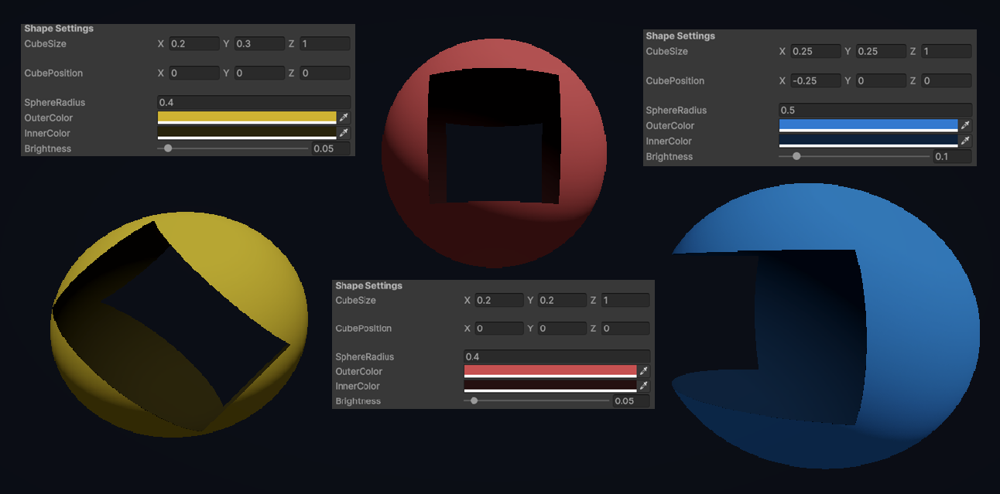  

**Capsule Cut with a Plane:** It provides a procedural capsule cut with a procedural plane.
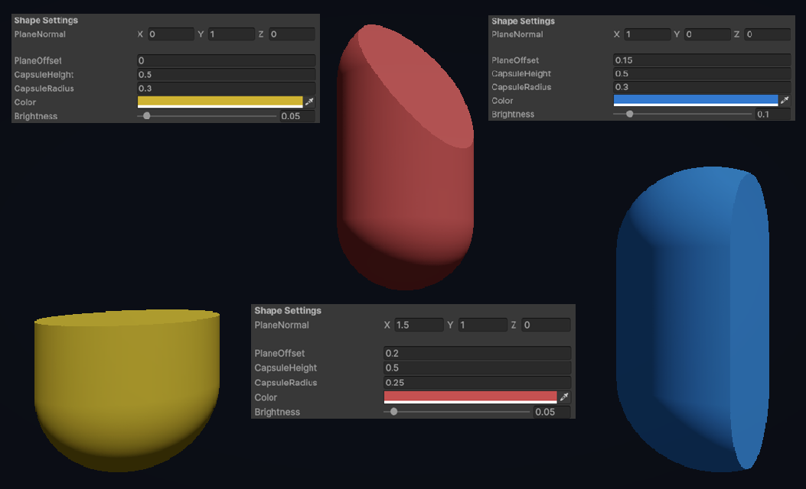  

**Mesh Cut with a Plane:** This example provides a mesh cut with a procedural plane. It can be used to cut or fill meshes at runtime using a customizable plane. Please note that, it doesn’t use the ray marching technique.
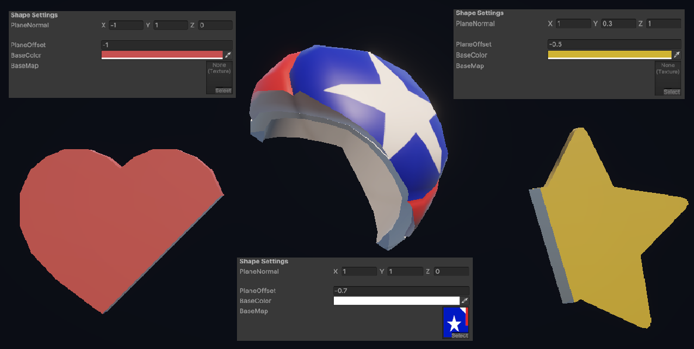  

## Compound Shapes

**Compound of Capsule and Sphere:** It provides a compound of a procedural capsule and a procedural sphere with a smoothed minimum function. Resulting shape is a potbellied capsule.
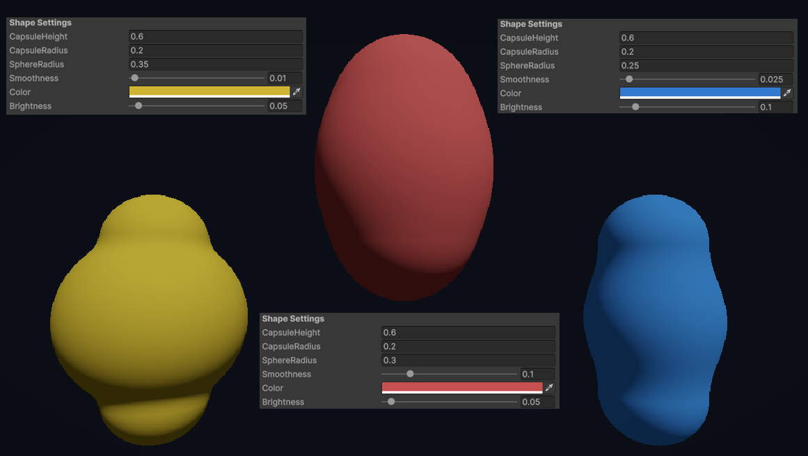  

**Compound of Cube and Sphere:** This example provides a compound of a procedural cube and a procedural sphere with a smoothed minimum function. Resulting shape is a rounded cube.
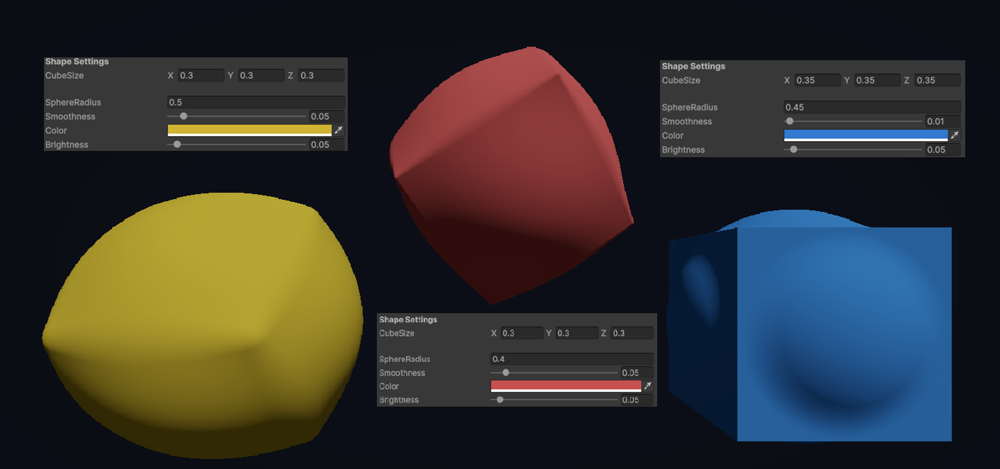  

**Compound of Sphere and Sphere:** It provides a compound of two procedural spheres with a smoothed minimum function. The final shape is connected spheres.
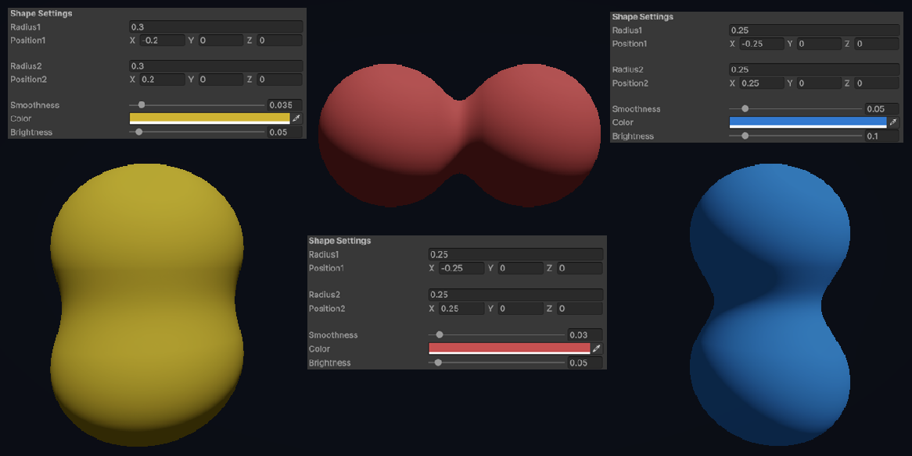  

## Basic Shapes

This repository includes several basic shapes such as capsule, cube, cylinder, sphere and torus. They can be used as a base to be able to create more complex shapes.
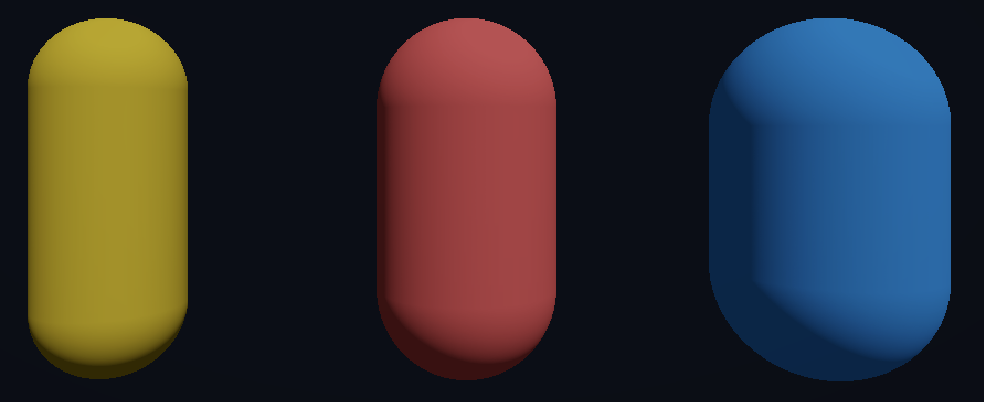
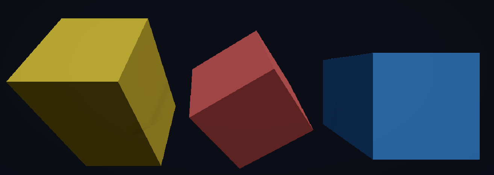
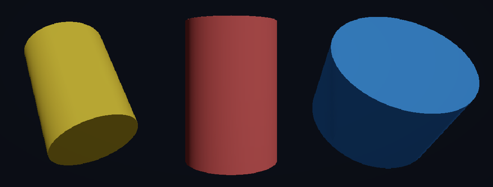
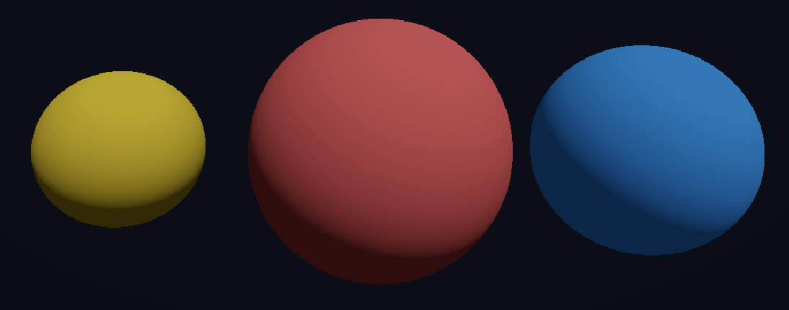
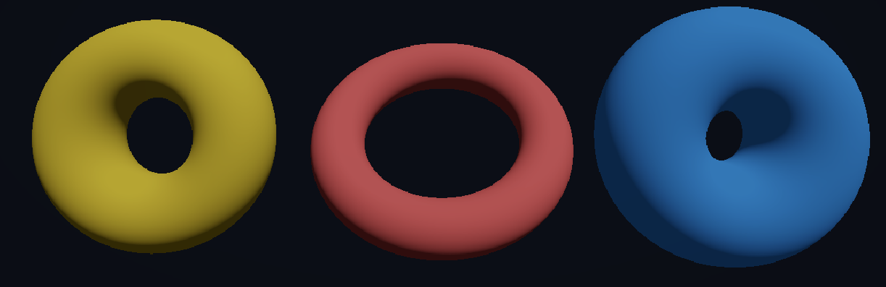
